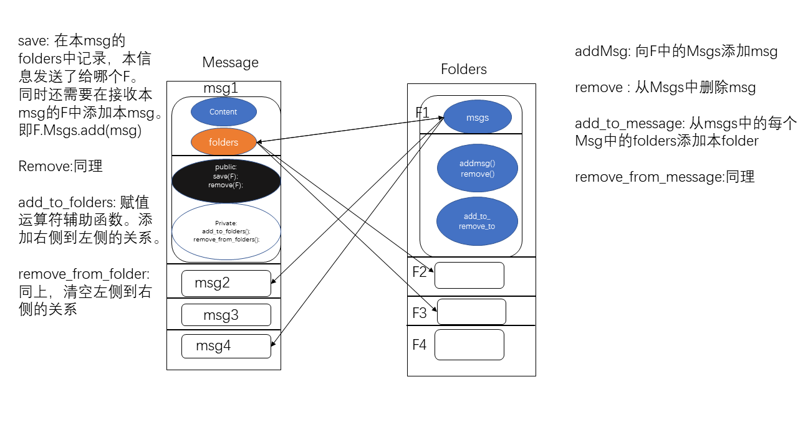
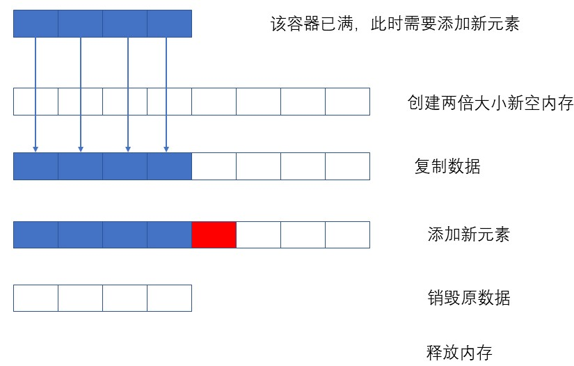
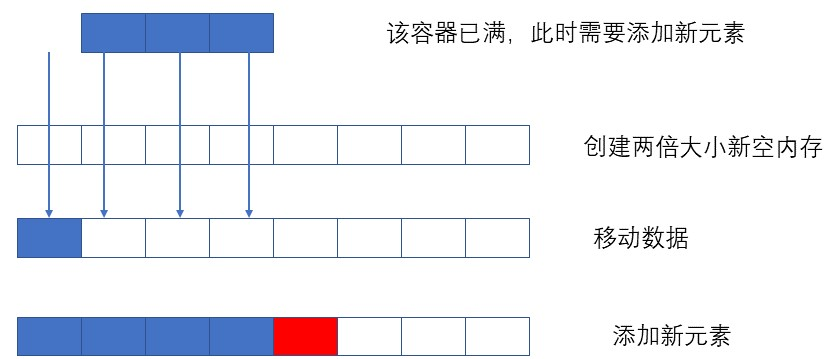

1. 三/五法则
2. 析构函数---->拷贝构造函数<===>拷贝赋值运算符
3. 自定义swap--->拷贝赋值运算符
# 拷贝控制
当定义一个类时，需显式或隐式的指定在此类型的对象**拷贝**、**移动**、**赋值**和**销毁**时做什么。
这些操作称为**拷贝控制操作：**

- **拷贝构造函数**和**移动构造函数**，定义了当用同类型的另一个对象初始化本对象时做什么(构造函数初始化)
- **拷贝赋值运算符**和**移动赋值运算符**，定义了将一个对象赋予同类型的另一个对象时做什么
- **析构函数**，定义了当此类别对象销毁时做什么

**尽量不要使用编译器给类默认定义的拷贝控制操作**

## 拷贝、赋值、销毁
### 拷贝构造函数
**拷贝构造函数定义：** 
构造函数
1. **第一个参数是自身类类型的引用**
2. **其他参数都有默认值**

-  第一个参数可以是非const版本，但几乎都是一个const版本
-  有时需要类型 进行隐式转换，因此拷贝构造函数通常不应该是explicit的

#### 合成拷贝构造函数 
一个类中必须要有一个拷贝构造函数，如果没有则编译器会默认生成一个。

- 对某些类来说，合成拷贝构造函数可以用来阻止我们拷贝该类类型的对象。
- 拷贝构造函数依次将参数拷贝到正在创建的对象中

#### 拷贝初始化
直接初始化和拷贝初始化的差异：
- **直接初始化根据构造函数重载直接创建对象**
- **拷贝初始化根据拷贝构造函数用另一个对象或显式或隐式创建一个新对象** 

**区别在于对象的个数**
示例：
```
//直接初始化
string dots(10,'.');
string s(dots);
//拷贝初始化
string  s2 = dots;
string null_book="99999";
```
拷贝初始化不经在使用`=`定义变量时发生，在下列情况也会发生。
1. 将一个对象作为实参传递给一个非引用类型的形参
2. 从一个返回类型为非引用类型的函数返回一个对象
3. 用花括号列表初始化一个数组中的元素或一个聚合类中的成员

拷贝初始化通常使用拷贝构造函数完成，但如果有移动构造函数，有时也会使用**移动构造函数**完成。

#### 参数和返回值
**拷贝构造函数为什么一定要是引用类型？**
```
A(const A &a):a(a.a){}//拷贝构造函数，正确类型，使用&引用
A(const A a):a(a.a){}//错误，非引用类型
```
在上述构造函数中，非引用&类型进行创建对象时，需要将实参拷贝赋值给形参a，这一过程是拷贝赋值，拷贝赋值则又要调用拷贝构造函数，往复循环，不曾更改。所以只有当使用引用时，才能不陷入死循环。因为引用是别名，直接使用对象，不需要拷贝赋值。

#### 拷贝初始化限制
如果拷贝构造函数时`explicit`的，则拷贝构造函数和直接初始化有本质区别。`explicit`表示类型不能进行隐式转换。
**示例**
```
vector<int> v1(10);
vector<int> v2=10;//错误，不能隐式转换成一个vector
```
#### 编译器可以绕过拷贝构造函数
在拷贝初始化过程中，编译器可以跳过拷贝/移动构造函数，直接创建对象。
```
string nullbook="000000000";//拷贝初始化
string nullbook("000000000");//跳过拷贝构造函数,直接初始化，构造函数重载
```
即使编译器跳过拷贝/移动构造函数，但拷贝/移动构造函数必须是存在且可访问的。如果没有创建，编译器会自动创建默认的

### 拷贝赋值运算符 (拷贝赋值运算符只是一个非构造函数的成员函数)
如果编译器未定义自己的拷贝赋值运算符，编译器会自动合成一个。
#### 重载赋值运算符
重载运算符本质是一个函数。定义形如下：
```
返回类型 operator=(参数列表 ):
```

- 重载运算符的参数表示运算符的运算对象。
- 某些运算符，包括赋值运算符，必须定义为成员函数
- 如果一个运算符是成员函数，则左侧运算对象就绑定到隐式的this参数
- 一个二元运算符，其右侧运算对象作为显式参数传递

**示例：**
```
class Foo{
    public:
        Foo& operator=(const Foo&);//赋值运算符
}
```
**赋值运算符通常应该返回一个指向其左侧运算对象的引用**
#### 合成拷贝赋值运算符

- 如果一个类未定义自己的拷贝赋值运算符，则编译器会为它生成一个合成拷贝赋值运算符。
- 对于某些类，合成拷贝赋值运算符用来禁止该类型对象的赋值
- 如果拷贝赋值运算符不是用来禁止赋值，则拷贝赋值运算符将右侧对象的非static成员赋予左侧
- 返回指向左侧运算对象的引用

**示例：**
```
Sales_data& Sales_data::operator=(const Sales_data &rhs){
    bookNo=rhs.bookNo;
    units_sold=rhs.units_sold;
    revenue=rhs.revenue;
    return *this;//返回一个指向此对象的引用
}
```
### 析构函数
析构函数释放对象使用的资源，并销毁对象的非static数据成员。
- 析构函数没有返回值，不接受参数。
- 析构函数唯一
- 析构函数中先执行函数体然后销毁成员。成员按初始化顺序，逆序销毁。
- 类类型成员调用自己的析构函数
- **内置类型没有析构函数，销毁内置类型成员什么都不要做。(成员为内置类型指针时，需显式调用delete 指针)**
```
~类名(){};//析构函数
```
#### 什么时候调用析构函数
只要对象被销毁，就会自动调用其析构函数。
#### 合成析构函数
当一个类未定义自己的析构函数时，编译器会默认定义一个合成析构函数。
- 对于某些类，合成析构函数被用来阻止该类型对象被销毁。
- 在析构函数体执行完毕后，成员会被自动销毁。
- 析构函数体自身并不直接销毁成员，析构函数体是作为成员销毁步骤之外的另一部分而进行的。

```
~类名(){}//合成析构函数
```
### 三/五法则 (析构函数——> 拷贝构造函数<===>拷贝赋值运算符)
控制类的拷贝操作：
1. 拷贝构造函数
2. 拷贝赋值运算符
3. 析构函数

C++不要求定义三个操作，但通常这三个操作都是一个整体，应当一起定义。这就是三/五法则中的三。

#### 需要析构函数的类也需要拷贝和赋值操作
判断是否需要自定义拷贝操作：
1. 判断类是否需要一个自定义的析构函数，比如类成员有内置指针。如果需要自定义析构函数，则也需要拷贝构造函数和拷贝赋值运算符。

#### 需要拷贝操作的类也需要赋值操作，反之亦然
通常都需要定义三个拷贝操作，但某些类所要完成的工作，只需要拷贝或赋值操作，不需要析构函数。
1. 需要拷贝构造函数则也需要拷贝赋值运算符，反之亦然
2. 拷贝构造函数和拷贝赋值运算符没有必然联系

### 使用`=default`
使用`=default`显式要求编译器生成合成的版本，以防自定义版本覆盖默认合成版本。
在不同位置使用`=default`含义不同：
1. 在类内使用时，合成的函数将隐式地声明为内联函数。
2. 当只对成员的类外定义使用`=default`时，非内联函数。
3. 只能对默认构造函数和拷贝控制成员使用`=default`。
   
### 阻止拷贝
**大多数类都应该定义默认构造函数、拷贝构造函数和拷贝赋值运算符。**
#### 定义删除的函数(阻止拷贝)
通过将拷贝操作定义为删除的类型来阻止拷贝。
在函数后面添加`=delete`。
如：
```
A& operator=(const A& a)=delete;//阻止赋值
```
**`=delete`必须出现在函数第一次声明的时候。**

#### 析构函数不能是删除的
**对于析构函数已经删除的类型，不能定义该类型的变量或释放指向该类型动态分配对象的指针**

#### 合成的拷贝控制成员可能是删除的

1. **如果一个类有数据成员不能默认构造、拷贝、赋值或销毁，则对应的成员函数将被定义为删除的**
2. 如果一个类有const成员，则合成的拷贝赋值运算符被定义为删除的。(不能给一个const变量赋值)
3. 有引用成员的类，合成的拷贝赋值运算符被定义为删除的。(引用是别名，赋值是两个对象)

#### private拷贝控制
将相关的函数定义为private,也能阻止拷贝(老版)。
## 拷贝控制和资源管理
定义拷贝操作：
1. 类的行为像一个值，意味着类的它应该也有自己的状态。当拷贝一个像值得对象时，副本和原对象是完全独立的。
2. 行为像指针的类则共享状态。当拷贝这种类的对象是，副本和原对象共享底层数据。
3. 当类中既包含类值成员，又包含类指针成员决定了该类是具有类值行为还是类指针行为。

### 行为像值的类
为了提供类值得行为，对于类管理得资源，每个对象都应该拥有一份自己的拷贝。
#### 类值拷贝赋值运算符
赋值运算符通常组合了析构函数和构造函数的操作。
**编写赋值运算符时，应当保证异常是安全的**
1. 拷贝右侧运算对象
2. 释放左侧对象内存
3. 赋值左侧对象
**防止提前释放左侧对象，而右侧对象拷贝失败。**
### 定义行为像指针的类
对于行为类似指针的类，需要为其定义拷贝构造函数和拷贝赋值运算符。拷贝指针成员本身，而不是指针成员底层的数据对象。
1. 令一个类展现除类似指针的行为的最好方法是使用shared_ptr管理类中的资源。
2. 为了直接管理资源，使用引用计数。

**引用计数：**

- 除拷贝构造函数外，创建引用计数，记录多少对象共享状态。计数器初始化为1
-  拷贝构造函数不分配新的计数器。而是拷贝计数器。拷贝构造函数递增共享计数器
-  析构函数递减计数器，计数器为0，则释放内存资源。
-  **拷贝赋值运算符递增右侧运算对象的计数器，递减左侧运算对象的计数器**。

**注意：**
1. 计数器不能直接作为类成员，而应该是类成员的指针，指向动态内存空间。
2. 拷贝和赋值时，拷贝指针对象。

## 交换操作
除了定义拷贝控制成员，管理资源的类通常还定义一个名为swap的函数。如果类定义了自己的swap，则算法将使用类自定义版本，否则调用标准库定义的swap。

1. 标准库swap函数会拷贝底层数据，再进行赋值
2. **当交换的是指针类型时，只要交换其指针即可，无序拷贝底层数据，此时需要定义自己的swap函数。**

**与拷贝控制成员不同，swap并不是必要的。但是对于分配了资源的类，定义swap可能时一种很重要的手段。**


当定义swap函数时，应当使用以下形式
```
using std::swap;
swap(a,b);
//或
swap(a,b);
```
而不是
```
std::swap(a,b);
```
### 在赋值运算符中使用swap
定义swap的类，通常用swap来定义它们的赋值运算符，这些运算符使用**拷贝交换技术**(即，形参使用赋值形式，函数体使用swap交换副本内容，达到赋值目的)。
**示例**
```
type& operator=(type b){
    swap(*this , b);
    return *this;
}
```
**使用拷贝和交换的赋值运算符自动就是异常安全的，且能正确处理自赋值。**
## 拷贝控制示例



## 动态内存管理类
在重新分配内存的过程中移动而不是拷贝元素。

**传统的重新分配内存的过程：**


**移动构造**


### 移动构造函数和std::move
通过使用新标准库引入的两种机制，可以避免拷贝。
1. #### 某些标准库类都定义了"移动构造函数"
    标准库保证正"移后源"(moved-from)仍然保持一个有效的可析构的状态。
2. #### 一个名为`move`的标准库函数
    - 定义在`<utility>`头文件中。
    - 必须调用`std::move()`来表示希望使用移动构造函数，不能是`move()`的形式

## 对象移动
新标准一个主要特性是可以移动而非拷贝对象的能力。通过移动而非拷贝，避免对内存的操作从而大幅提高性能。
**移动特性**
1. 避免内存操作，提高性能
2. 某些类包含不能被共享的资源，不能拷贝

**标准容器库,string和shared_ptr类即支持移动也支持拷贝。IO类和unique_ptr类可以移动但不能拷贝。**

### 右值引用
为了支持移动操作，新标准引入一种新的引用类型 **:右值引用**。
```
int &&i=10;//右值引用
```
**右值引用特性：**
1. 右值引用是必须绑定到右值
2. 右值表达式表示的对象的值
3. 右值引用只能绑定到一个将要销毁的对象右值。
4. 右值引用的对象没有其他用户(比如上面的10)

```
int i=42;
int &r = i;
int &&rr = i;//错误，i是对象，是左值
int &r2=i*42;//错误，i*42生成一个临时的右值
const int &r3 = i*42;//正确，const 引用可以绑定到右值
int &&rr2=i*42;//正确，将rr2绑定到一个右值
```
**右值引用指向将要被销毁的对象。因此，可以从绑定到右值引用的对象”窃取状态“**

#### 变量是左值
变量表达都是左值，即使是右值引用对象也是左值。不能将一个右值引用绑定到一个右值引用类型的变量上。
```
int &&rr1=10;
int &&rr2=rr1;//错误，rr1是左值，即使其是右值引用
```
#### 标准库move函数（对左值获取接管的内存）
虽然不能将一个右值引用直接绑定到一个左值上，但可以显式的将一个左值转换为对饮的右值引用类型。通过调用一个move的新标准库函数来获得绑定到左值上的右值的引用。
```
int &&rr3 = std::move(rr1);//正确，rr1即可以是左值也可以是右值。本例中rr1是右值，rr3接管rr1的内存
```
必须使用下列类型
```
std::move();
```
而不是该类型
```
move();
```
### 移动构造函数和移动赋值运算符 （接管内存）
1. 移动构造函数第一参数是该类型的一个右值引用，且额外参数必须有默认实参。
2. 移动构造函数必须确保移后源（move_from）对象处于销毁无害状态，即将指针赋为空指针。否则析构将delete空指针。

**示例：**
```
类名（类名 右值）noexcept:参数初始化{指针赋空} //指针必须为空，否则析构右值时将释放我们获得的对象。
```
#### 移动操作、标准库容器和异常
移动操作通常不会抛出任何异常。当编写一个不抛出异常的移动操作时，应该将此事通知标准库。
**noexcept:** 通知不抛出异常，且必须在声明和定义处均指定。

**要点：**
1. 移动操作通常不抛出异常，但抛出异常也是允许的
2. 标准库容器需对异常发生时，其自身能回滚到异常发生前的状态
3. 除非知道移动构造函数不会抛出异常，否则在重新分配内存的过程中只会调用拷贝构造函数而不会调用移动构造函数。如果希望使用移动操作，就应该指定`noexcept`

#### 移动赋值运算符
与移动构造函数一样，移动赋值运算符也不应该抛出异常(添加noexcept)。
**需要考虑自赋值的情况：**
1. 如果两个变量指向的是不同变量，则先析构左侧对象和释放左侧内存，再进行移动
2. 如果两个变量指向的是相同地址内存，则不能析构左侧对象，直接返回即可。

**在移动操作之后，移后源对象必须保持有效的，可析构的状态，但用户不能对其值进行任何假设。**
#### 合成的移动操作
**只有当一个类没有定义任何自己版本的拷贝控制成员，且类的每个非static数据成员都可以移动时，编译器才会合成移动构造函数或移动赋值运算符。**

**移动控制成员被定义为删除的情况：**
1. 定义了拷贝控制成员
2. 不能移动所有非static类成员

**定义了一个移动控制成员的类也必须定义自己的拷贝操作，否则，这些拷贝操作默认定义为删除的**

#### 移动右值，拷贝左值
如果一个类既有移动操作，又有拷贝操作，编译器使用普通函数的匹配规则来确定。
#### 如果没有移动操作，则右值也被拷贝
#### 拷贝并交换赋值运算符和移动操作
**如果一个类同时定义了移动构造函数和拷贝交换赋值运算符，则该拷贝交换赋值运算符即使移动赋值运算符也是拷贝赋值运算符**
#### 三/五法则
如果一个类定义了任何一个拷贝操作，则应该定义所有五个操作。

**析构函数\-\-\-\-\>拷贝构造函数\<\=\=\=\=\=\=\=\>拷贝赋值运算符**  ， 移动构造函数，移动赋值运算符。

如果拷贝赋值运算符是使用拷贝并交换，同时定义了移动构造函数，则拷贝赋值运算符即使拷贝赋值运算符也是移动赋值运算符。
**即：**
析构函数 拷贝构造函数 移动并交换赋值运算符 移动构造函数。

以上四种即可满足五个拷贝控制成员要求。

#### 移动迭代器 （make_move_iterator）
新标准库定义了一种**移动迭代器**适配器。一个移动迭代器通过改变给定迭代器的解引用运算符的行为来适配此迭代器。

**移动迭代器：** 接受一个普通迭代器，返回一个迭代器指向的右值引用。
```
make_move_iterator(begin());
```
**由于一个移后源对象具有不确定的状态，对其调用std::move是危险的。当我们调用move时，必须绝对确认移后源对象没有其他用户。**

### 右值引用和成员函数
除了构造函数和赋值运算符之外，如果一个成员函数同时提供拷贝和移动版本，它也能从种受益。
**区分移动和拷贝的重载函数通常由一个版本接受一个`const T&`,而另一个版本接受一个`T&&`**

#### 右值和左值引用成员函数
**引用限定符指定成员函数返回的是左值还是右值类型：**
```
返回类型 函数名（函数形参）&;//返回左值类型
返回类型 函数名（函数形参）&&;//返回右值类型
```
1. 引用限定符只能用于非static成员函数
2. 引用限定符必须同时出现在声明和定义中
3. const和引用限定符同时使用，引用限定符必须在const之后
   
#### 重载和引用函数
成员函数可以根据是否有const和引用限定符来区分其重载版本。const和引用限定符可以同时使用，const的有或无，引用限定符的有或无都可以认为其的重载版本。

```
Foo sorted()&&;
Foo sorted()const;//错误，必须加上引用限定符
Foo sorted(Comp*);
Foo sorted(Comp*)const;
```
**要点：**
1. 如果两个或两个以上相同名字和相同参数列表的成员函数，要么对所有函数都添加引用限定符，要么所有函数都不添加引用限定符

