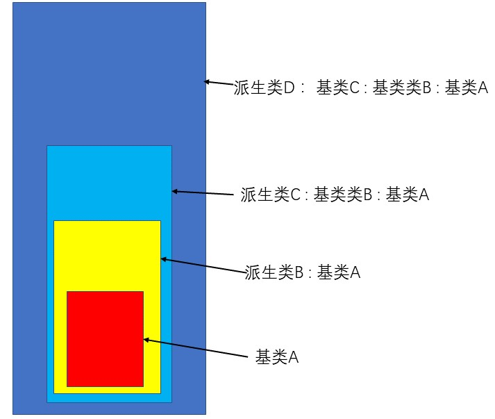
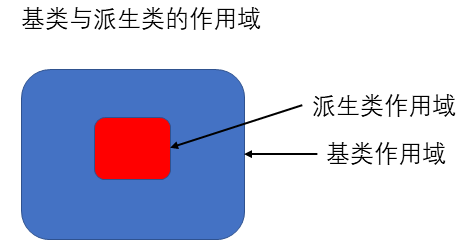

继承和动态绑定对程序有两方面的影响：
1. 可以更容易定义与其他类相似但不完全相同的新类。
2. 在这些彼此相似的类编写程序时，可以在一定程度上忽略它们的区别。（形参父类，实参子类）
# 面向对象程序设计
## OOP：概述
**面向对象程序设计核心思想:**
1. **数据抽象**： 将类的接口和实现分离
2. **继承**： 可以定义相似的类型并对相似关系建模
3. **动态绑定** ： 可以在一定程度上忽略相似类型的区别，而以同一的方式使用它们的对象。

**继承**

- 通过**继承**联系在一起的类构成一种层级关系。
- **虚函数：** C++中，基类将类型相关的函数与派生类不做改变直接继承的函数区分对待。对于某些函数，基类希望它的派生类各自定义合适自身的版本。此时基类就将这些函数声明成**虚函数**。函数前添加关键字**`virtual`**
- **派生列表：** 派生类必须通过使用类派生列表明确指出它是哪个基类继承而来的。`class 子类：访问说明符 基类{};`
- 派生类需在内部对所有重写定义的虚函数进行声明，通过关键字`virtual`。也可以允许派生类显式的注明派生类将使用哪个成员函数改写基类的虚函数。在形参列表之后添加关键字`override`

**动态绑定**

通过使用动态绑定，可以使用同一段代码分别处理基类和派生类。具体形式如下
```
返回类型 函数名(基类，其他形参列表);
```
该函数可以在运行时，根据传入的实参类型选择具体执行哪个版本的函数。所以**动态绑定**又叫**运行时绑定**。
**在C++语言中，使用基类的引用（或指针）调用一个虚函数时将发生动态绑定。**

## 定义基类和派生类。
### 定义基类
**基类通常都应该定义一个虚析构函数，即使该函数不执行任何实际操作也是如此。**
#### 成员函数与继承
派生类可以继承其基类的成员，但是派生类必须对虚函数进行重新定义自己的新操作以覆盖基类的虚函数。

基类必须将两种成员函数区分开：
1. 基类希望派生类进行覆盖的函数，定义为虚函数，**函数声明语句前添加`virtual`，关键字只能在类内部使用**
2. 基类希望派生类直接继承而不要改变的函数。
3. 任何构造函数之外的非静态函数都可以是虚函数。
4. 如果基类吧一个函数声明成虚函数，则该函数在派生类中隐式的也是虚函数。
5. 成员函数如果没被声明为虚函数，则其解析过程发生在编译时而不是运行时。

#### 访问控制与继承
1. private,  任何非本类，非friend的类和函数均不可访问
2. protect ， 派生类可以访问，其他非friend的类和函数不可访问
3. public ， 任何类和函数均可访问。

### 定义派生类
派生类必须通过使用**类派生列表**明确指出它是从哪个基类继承而来的。
```
class 子类：访问说明符 基类{};//访问说明符的作用是控制派生类从基类继承而来的成员是否对派生类的用户可见。
```
- 如果一个派生类是公有的，则基类的公有成员也是派生类接口的组成部分。
- 派生类即可以单继承也可以多继承
#### 派生类中的虚函数
- 派生类可以覆盖它从基类所继承的虚函数，但不是必须。如果不覆盖，则只继承基类版本
- 派生类可以在它覆盖的函数前使用`virtual`关键字，指定从基类继承的虚函数，在派生类中被覆盖且同样为虚函数。如果覆盖为虚函数，则需在形参列表、const函数const关键字或引用限定符后添加`override`关键字。

#### 派生类对象及派生类向基类的类型转换


一个派生类对象包含多个组成部分：
1. 一个含有派生类自己定义的（非静态）成员的子对象；
2. 一个与该派生类继承的基类对应的子对象。

因此派生类含有与其基类对应的组成部分，所以能把派生类的对象当成基类对象使用。即：**基类的指针或引用能绑定倒派生类对象中的基类部分。（动态绑定的实质）** 这就是**派生类到基类的类型转换**，由编译器隐式完成。
```
基类 *p = 子类对象;
基类 &ref = 子类对象；
```
**只能基类指针和引用绑定派生类对象，不能反之**
#### 派生类构造函数
**每个类控制自己的成员初始化过程**

- 派生类不能直接初始化从基类继承的成员，必须使用基类的构造函数初始化派生类的基类部分。
- 首先初始化基类的部分，然后按照声明的顺序一次初始化派生类的成员

#### 派生类使用基类的成员
派生类可以访问基类的public和protected成员
#### 继承与静态成员
1. 如果基类定义了一个静态成员，则在整个继承体系中只存在该成员的唯一定义
2. 静态成员遵循通用的访问控制规则，派生类无法访问基类的private静态成员，如果静态成员是非private的，则即可以通过基类也可以通过派生类访问。

#### 派生类的声明
派生类声明中包含类名但是不包含它的派生列表。
```
class 派生类;//正确
class 派生类:访问说明符 基类; //错误，这只是声明，不是定义
```
派生列表以及与定义有关的其他细节必须与类的主题一起出现。
#### 被用作基类的类
某个类如果要被用作基类，则必须已经定义而不能只是声明。
#### final 禁止继承
在类名后加上final关键字，禁止该类的继承。

### 类型转换与继承
和内置指针一样，智能指针类也支持派生类向基类的类型转换。这意味着我们可以将一个派生类对象的指针存储在一个基类的智能指针内。

#### 静态类型和动态类型
1. **静态类型**在编译时总是已知的，它是变量声明时的类型或表达式生成的类型。
2. **动态类型：** 是变量或表达式表示的内存中的对象的类型，在运行时才可知

**基类的指针或引用的静态类型可能与其动态类型不一致，就是形参为基类的指针或引用，实参为派生类。**
#### 不存在从基类向派生类的隐式类型转换
因为派生类有其独立于基类的独有成员，所以不存在派生类向基类的隐式类型转换。指针和引用也不行。
```
派生类 a
基类 *b = &a;//正确
派生类 *a_ptr = b;//错误，b是一个指向基类的指针，a_ptr是一个派生类指针。不存在用派生类指针指向基类、
```
- 可以使用`dynamic_cast`来请求一个对基类的类型转换，转换在运行时执行安全检查
- 当确定基类向派生类的转换是安全的时，可以使用`static_cast`强制覆盖编译器的检查工作
#### 在对象之间不存在类型转换
派生类向基类的自动类型转换只对指针或引用有效。
```
//基类拷贝构造函数
基类(const 基类& );
基类 基类对象(派生类对象);//使用拷贝构造函数，实参为派生类。
```
在该基类对象的构造过程中，只会使用到派生类中基类对象部分。其余派生类部分会被忽视掉(**切掉**)。
*****
**存在继承关系的类型之间的转换规则**
1. 从派生类向基类的类型转换只针对指针和引用类型调用虚函数有效
2. 基类向派生类不存在隐式转换
3. 和任何其他成员一样，派生类向基类的类型转换也可能会由于访问受限而变得不可行
*********
## 虚函数
当且仅当对通过指针或引用调用虚函数时，才会在运行时解析该调用，也只有在这种情况下对象的动态类型才有可能与静态类型不同。
### 对虚函数的调用可能在运行时才被解析
### 派生类中的虚函数
1. 类中继承的虚函数如果想让派生类覆写 ， 则可以将该函数定义为虚函数添加`virtual`，即使该函数也是从基类中继承过来的虚函数
2. 类中继承的虚函数如果不想让派生类覆写 ， 则必须将该函数定义成`final`,在函数体之前添加关键字`final`。
3. 只有继承的虚函数才能加`final`。派生类从基类中继承的虚函数，要么加`virtual`要么加`final`。两者必要其一

**派生类的函数如果覆盖某个继承而来的虚函数，则形参类型必须保持一样**
**派生类中的虚函数的返回类型也必须与基类函数匹配（没说要一样，只要返回类型为指针或引用，且派生类返回类型可以向基类返回类型转换即可）。** 当类的虚函数返回类型是类本身的指针或引用时，该规则无效。

###  final和override说明符
当覆写继承自基类的虚函数时，可以在虚函数后添加`override`关键字，使编译器辅助检查是否覆写基类虚函数成功。覆写虚函数必须要求形参一致，否则就是覆写失败，产生一个新函数。当调用这个函数将与真实意图产生差异导致错误。**只有虚函数才能被覆写**，添加`override`很关键。

将函数指定为`final`,可禁止任何派生类对改函数的覆盖。

### 虚函数与默认实参
虚函数也可有默认实参。如果虚函数使用默认实参，则基类和派生类中定义的默认实参最好一致。
### 回避虚函数机制
希望对虚函数的调用不要进行动态绑定，而是强迫其执行虚函数的某个特定版本。使用作用域运算符可以实现这一目的。
```
double undiscounted = basep->Quote::net_price(42); //无论basep指向什么，都将调用特定的版本函数。
```
通常当一个派生类的虚函数调用它覆盖的基类的虚函数版本时，需要进行回避虚函数。
如果一个派生类虚函数需要调用它的基类版本，而没有使用作用域运算符，则在运行时该调用将被解析为对派生类版本自身的调用，导致无限递归。

## 抽象基类
当我们需要高度抽象某个类事务时，就需要定义抽象基类。**抽象基类只定义要干什么(纯虚函数)，具体怎么干由派生类决定(派生类覆写基类的纯虚函数)**

### 纯虚函数
声明纯虚函数，普通函数只要在函数体处书写`=0`即可定义为纯虚函数。
```
返回类型 函数名（形参列表）其他 =0;
```
`=0`只能出现在类的内部，纯虚函数可以只声明不定义。如要定义则必须在类外部定义。

### 含有纯虚函数的类是抽象基类
1. 含有纯虚函数的类就是**抽象基类**
2. 抽象基类负责定义接口，派生类覆盖接口
3. **抽象基类不能创建对象**
### 派生类构造函数只初始化它的直接基类
派生类构造函数只初始化其直接基类和派生类自己独有的成员。
## 访问控制与继承
每个类分别控制自己的成员初始化过程，每个类还分别控制着其成员对于派生类来说是否**可访问**
### 受保护的成员
1. **protected:**
    
    - 受保护的成员对于类的用户(其他使用该类对象的函数或类，非友元和派生类)来说是不可访问的
    - 基类的受保护成员对于派生类的成员和友元来说是可访问的
    - 派生类的成员或友元只能通过派生类对象来访问基类的受保护成员。派生类对于一个基类对象中的受保护成员没有任何访问权限。

    ```
    class Base{
        protected:
            int prot_mem;
    };
    class Sneaky:public Base{
        friend void clobber(Sneaky&); //能访问Sneaky::prot_mem，因此这是派生类的友元函数能访问派生类中的成员
        firend void clobber(Base&); //不能访问Base::prot_mem , 因为这是派生类的友元函数，只能访问派生类，此处形参为基类，友元函数不是基类的友元
    };
    void clobber(Sneaky& s){s.j=s.prot_mem=0;}//正确
    void clobber(Base& b){b.prot_mem=0;}//错误
    ```
### 公有、私有和受保护继承
某个类对其继承而来的成员的访问权限受到两个因素的影响：
1. 在基类中该成员的访问说明符
2. 派生类的派生列表中的访问说明符

- **派生访问说明符对于派生类的成员(及友元)能否访问其直接基类的成员没有影响，派生类能否访问其基类的成员，只与基类成员的访问控制符有关**
- **派生访问说明符的目的是控制派生类的用户(即：使用该类的其他类或函数)对于基类成员的访问权限。**
- 如果派生类是private继承基类，则派生类中的基类部分的访问控制为private，依次类推

**区分普通用户和类的实现者：**
1. 普通用户是 **编写的代码使用类的对象**
2. 类的实现者 **负责编写类的成员和友元代码**

**派生访问说明符** 控制的是普通用户对派生类中基类的访问权限。
**派生类能否访问基类中的成员：** 只与基类中成员的访问控制符有关

### 派生类向基类转换的可访问性
**对于代码中的某个给定节点来说，如果基类的公有成员是可访问的，则派生类向基类的类型转换也是可访问的；反之不行。**

### 友元与继承
友元关系不能传递，也不能继承。每个类负责控制各自成员的访问权限。
基类的友元函数或类，能访问该基类的派生类中的基类部分。
### 改变个别成员的可访问性
通过using声明改变
```
class base{
    public:
        std::size_t size()const {return n;}
    protected:
        std::size_t n;
};
class Derived:private Base{
    public:
        using Base::size; //修改派生类中继承的基类的成员的访问权限 , 该基类成员
        //在派生类中是public的，而不是private
    protected:
        using Base::n;//
};
```
Derived的普通用户可以访问size成员。

派生类只能为哪些它可以访问的名字提供using声明。

### 默认的继承保护级别
默认派生运算符由定义派生类的关键字决定。
```
class 派生类:基类{};//private继承
struct 派生类:基类{};//public继承
```
**一个私有派生的类最好显式的将private声明出来**
## 继承中的类作用域


**如果一个名字在派生类的作用域内无法正确解析，则编译器将继续在外层的基类作用域中寻找该名字的类。**

### 在编译时进行名字查找
一个对象、引用或指针的静态类型决定了该对象的哪些成员是可见的。成员查找从对象的静态类型中开始查找，一直往上直到找到为止。
```
base *basePtr = &subObject;
basePtr->base_mem;//从baseptr的静态类型为base，从base中往上开始查找
basePtr->subClass_mem;//错误：从baseptr的静态类型为base，从base中往上开始查找。subClass_mem为派生类成员，不在查找范围内。
```
### 名字冲突和重载
**派生类成员将隐藏同名的基类成员**
### 通过作用域运算符来使用隐藏的成员
作用域运算符将覆盖掉原有的查找规则，直接从作用域前的类名开始查找。
**除了覆盖继承而来的虚函数之外，派生类最好不要重用其他定义在基类中的名字。**
************
函数调用解析过程，假设调用p->mem(),则执行以下4个步骤：
1. 首先确定p的静态类型。
2. 从p的静态类型中查找mem，如果找不到则往上基类中查找，直到顶端。
3. 一旦找到就进行常规类型检查，确认调用是否合法
4. 如果调用合法，编译器将根据调用的是否是虚函数产生不同代码进行动态绑定。
************
### 名字查找先于类型检查
声明在内层作用域的函数并不会重载声明在外层作用域的函数。只要派生类的成员与基类的某个成员同名，即使形参列表不一致，基类成员也会被隐藏掉。
```
struct base{
    int memfcn();
};
struct Derived : base{
    int memfcn(int);
};
Derived d ; base b;
d.memfcn();//错误，从Derived作用域中开始查找，找到名为int memfcn(int)的成员。即停止查找，形参与实参不匹配，出错。
```
编译器在成员查找过程中，一旦找到相同名字的成员，就不再继续查找。查找过程中不进行类型检查。
### 虚函数与作用域
基类与派生类中的虚函数必须由相同的形参列表。如果基类与派生类的虚函数接收的实参不同，则无法通过基类的指针或引用调用派生类的虚函数。
### 通过基类调用隐藏的虚函数
只要理解成员的查找过程，成员的隐藏原理，动态绑定原理即可。
### 覆盖重载的函数
using声明语句指定一个基类成员函数的名字而不指定形参列表，就可以把该函数的所有重载实例添加到派生类作用域中。此时，派生类只要定义其特有的函数就可以实现重载，无须为继承而来的其他函数重新定义。

类内的using声明的一般规则同样适用于重载函数的名字;基类函数的每个实例在派生类中都必须是可访问的。对派生类没有重新定义的重载版本的访问实际上是对using声明点的访问。

## 拷贝函数与拷贝控制
### 虚析构函数
通过在基类中将析构函数定义成虚函数以确保执行正确的析构函数版本。
```
class Quote{
    public:
        virtual ~Quote()=default;
};
```
**基类的析构函数一定是虚函数** ， 基类的析构函数不遵循三/五法则。
#### 虚析构函数将阻止合成移动操作
如果一个类定义了析构函数，即使它通过`=default`的形式使用了合成的版本，编译器也不会为这个类合成移动操作。
### 合成拷贝控制与继承
- 派生类构造函数从该派生类的最顶端基类开始构造对象。
- 派生类的析构函数除了销毁派生类自己的成员还还要调用其直接基类的析构函数。
- 构造函数与析构函数的方向是相反的。
#### 派生类中删除的拷贝控制与基类的关系
基类中定义的构造、赋值、销毁操作是不可访问的，将导致派生类的某些操作被删除。
例如：
1. 如果基类的析构函数不可访问或者是被删除的，则派生类中合成的默认和拷贝构造函数将是被删除的。因为编译器无法销毁派生类对象的基类部分。

**在实际编程过程中，如果在基类中没有默认、拷贝或移动构造函数，则一般情况下派生类也不会定义相应的操作。**

#### 移动操作与继承
大多数基类都会定义一个虚析构函数，因此默认情况下，基类通常不含有合成的移动操作，而且在派生类中也没有合成的移动操作。
**当确实需要执行移动操作时，应该首先在基类中定义** 除非派生类中含有排斥移动的成员，此后派生类将自动获得合成的移动操作。

### 派生类的拷贝控制成员
**当派生类定义了拷贝或移动操作时，该操作负责拷贝或移动包括基类部分成员在内的对象。**
#### 定义派生类的拷贝或移动构造函数
**在默认情况下，基类默认构造函数初始化派生类对象的基类部分。如果想拷贝或移动基类部分，则必须在派生类的构造函数初始值列表中显式的使用基类的拷贝或移动构造函数。**
```
class Base{/*...*/};
class D: public Base{
    D(const D& d):Base(d)/*D的成员的初始值*/{}
    D(D&& d):Base(std::move(d))/*D的成员的初始值*/{}
};
```
#### 派生类赋值运算符
与拷贝和移动构造函数一样，派生类的赋值运算符也必须显式的为其基类部分赋值。
```
//Base::operator=(const Base&) 不会被自动调用
D& D::operator=(const D& rhs){
    Base::operator=(rhs);//为基类部分赋值
    //其他派生类成员赋值
    return *this;
}
```
#### 派生类析构函数
派生类的析构函数只负责销毁由派生类自己分配的资源。对象销毁顺序与创建顺序相反。
```
class D:public Base{
    public:
        //Base:~Base被自动调用执行
        ~D(){/*用户定义的派生类成员销毁操作*/}
};
```
#### 在构造函数与析构函数中调用虚函数
**如果构造函数或析构函数调用了某个虚函数，则我们应该执行与构造函数或析构函数所属类型相对应的虚函数版本。**

### 继承的构造函数
1. 一个类只继承其直接基类的构造函数。
2. 类不能继承默认、拷贝和移动构造函数。如果派生类没有直接寄定义这些构造函数，则编译器将为派生类合成它们。

派生类继承基类构造函数的方式：
- **提供一条注明了直接基类名的using声明语句**
```
class 派生类: 派生类访问符 基类{
    public:
        using 基类::基类；//继承基类的每个构造函数
};
```
- **`using`声明语句将编译产生代码，对于基类的每个构造函数，编译器都在派生类中生成一个参数列表完全相同的构造函数。**

#### 继承的构造函数的特点
和普通成员的using声明不同，不管using声明出现在哪，构造函数的using声明不会改变该构造函数的访问级别。

一个using声明语句不能指定explicit或constexpr。如果基类的构造函数是explicit或constexpr，则继承的构造函数也拥有相同的属性。

- 当一个基类的构造函数的含有默认实参，这些实参并不会都被继承。派生类将获得多个继承的构造函数，其中每个构造函数分别省略一个含有默认实参的形参。
- 如果基类含有几个构造函数，除以下两个情况外，大多数派生类都会继承所有这些构造函数。
    1. 如果派生类定义的构造函数与基类的构造函数具有相同的参数列表，则该构造函数将不会被继承。
    2. 默认、拷贝和移动构造函数不会被继承。这些构造函数按照正常规则被合成。
## 容器与继承
**当派生类对象被赋值给基类对象时，其中的派生类部分将被切掉，因此容器和存在继承关系的类型无法兼容。**
### 在容器中放置只能指针而非对象
当我们希望在容器中存放具有继承关系的对象时，存放的通常是基类的智能指针。这些指针所指对象的动态类型可能是基类类型，也可能是派生类类型。
```
vector<shared_ptr<Quote>> basket;
basket.push_back(make_shared<Quote>(bookName,price));
basket.push_back(make_shared<Bulk_quote>("0-201-82470-8",50 ， 10  ， 0.75));//我们可以把派生类的智能指针转换成基类的智能指针
```
### 模拟虚拷贝
为了能向函数中直接传入对象，而不是传入特定类型的指针，使函数更有泛化能力。将形参类型由特定指针类型转换为基类类型，利用继承中的动态绑定特性。然而在构造动态内存时，需要直到其动态类型。函数中静态类型为函数形参 ， 动态类型为对象本身类型。无法直接获取动态绑定时对象的动态类型。所以在基类中定义一个 **返回指向该类动态内存的指针类型** 的虚函数。此时可以通过对象动态绑定的类型调用该函数，获得一个指向该对象的动态内存的指针。
**具体见`Quote.h`中clone函数。**

## 文本查询程序再探

