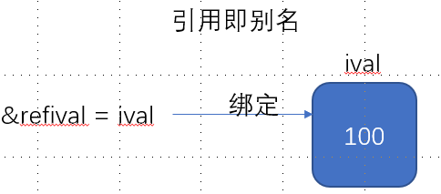
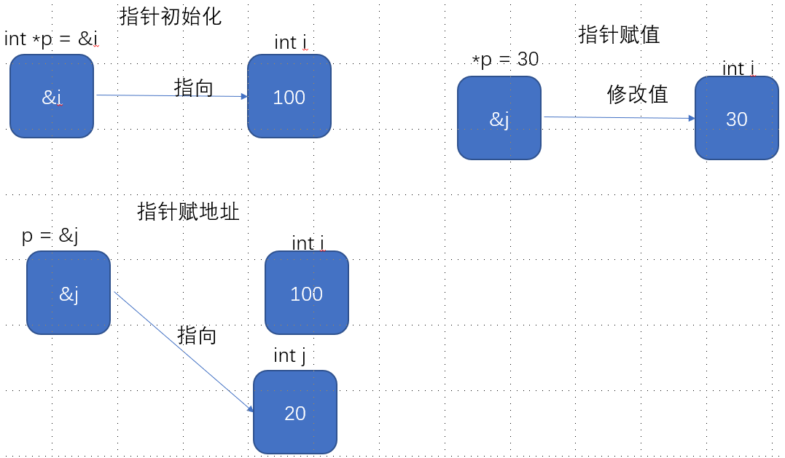

# 第二章 变量和基本类型
## 2.1类型转换
* 给无符号类型赋值超过表示范围的值时，结果时初始值对无符号类型表示数值总数取模后的余数
* 给带符号类型赋值超过表示范围的值时，结果**未定义**
* unsigned 范围： 0-4294967295
  
## 变量
### 初始化
* 定义于函数体内的内置类型的对象如果没有初始化，则其值未定义，类的对象如果没有显示的初始化，则其值由类决定。
* 当使用列表初始化且初始值存在信息丢失风险时，编译器将报错
### 变量声明和定义
C++ 支持分离式编译，将声明和定义区分开。
**声明：** 一个文件如果想使用别处定义的名字则必须包含对那个名字的声明
**定义：** 创建与名字相关联的的实体。
**声明变量而不定义**：变量名前添加关键字`extern`
例如：extern int i ；
extern 语句变量赋初值则变成定义
**变量只能被定义一次，但可以被声明多次。**
### 作用域
每个变量都只在作用域内生效，内层作用域中可以访问外层作用域内的变量。当内层作用域与外层作用域有相同的变量时，内层作用域通过`::`符号访问外层作用域的变量。

## 复合类型：指针与引用
一条声明由一个**基本数据类型**和紧随其后的一个声明符列表组成。
`int i`
### 引用(引用即别名，必须初始化)
引用分：左值引用与右值引用。
#### 左值引用
引用类型：&i

引用只是在初始化时要求多，初始化后相当于一个变量
1. 引用类型初始值必须是一个对象。
2. 引用的类型必须与绑定的对象严格匹配。
3. 引用类型初始值时，必须对象类型相同。初始值后，可不同，但存在信息丢失。
4. 引用无法解绑。
### 指针
指针也实现对其他对象的间接访问。
指针与引用的区别：
1. 指针本身就是一个对象，允许对指针赋值和拷贝。指针生命周期内可以先后指向不同对象。
2. 指针无需再定义时赋初值。未初始化则初始值随机。
#### 指针声明
- `声明类型 *声明变量`
 `int *i;`
- 指针存放某个对象地址，获取该地址用取地址符。
 `int i=12; int *pti=&i;`
- 指针类型应与指向对象类型严格匹配

指针值应处于四种状态之一
1. 指向一个对象
2. 指向邻近对象所占空间的下一个位置
3. 空指针，未指向任何对象
4. 无效指针，除上述情况外的其他值

访问无效指针将报错，访问2，3情况指针结果不可预测。

#### 指针使用
**解引用符** `*`
```
int i = 42;
int *p = &i; //p是一个指针，p中存放的是i的地址。左边*是指针声明，右边&是取值符
```
```
*p = 23;//指针可以直接赋值
```

`&`既是引用声明符也是取值地址符。
`*`即是指针声明符也是解引用符。
具体看符号在赋值运算符左边还是右边。
#### 空指针
**空指针**不指向任何对象。
`空指针声明`
```
int *p1 = nullptr; //特殊类型字面值，可以被转换成任意其他的指针类型。(强烈推荐使用)
int *p2 = 0;
int *p3 = NULL; // 需 #include <cstdlib>
```
**建议：**
1. 初始化所有指针
2. 定义对象后定义其指向指针

合法指针可以用于表达式。

#### void * 指针
`void *`指针是一种特殊的指针类型，可以存放任意对象的地址。
```
double obj = 3.14, *pd = &obj;
void *pv = &obj;
pv=pd;
```
#### 指向指针的指针
声明符中修饰符个数无限制。通过`*`个数可以区分指针级别。`**`表示指向指针的指针，`***`表示指向指针的指针的指针。

#### 指向指针的引用
引用本事不是一个对象，因此不能定义指向引用的指针。但指针式对象，所以存在对指针的引用。
```
int i=12;
int *p;  //定义一个指针
int *&ref=p;  //定义一个指向指针的引用，即（指针的别名）

ref=&i ; //ref是指针p的别名，即指针p指向i
*ref=0;  //ref是指针的别名，p指向i，即修改i的值为0
```
从右向左阅读定义，离变量名最近的符号对变量的类型有最直接的影响。

### const限定符
#### **判断是底层const还是顶层const：**
**只需要判断const是在*左边还是右边即可。左边则是修饰被指物，即被指物是常量，不可修改它的值；顶层const: 右边则是修饰指针，即指针是常量，不可以修改它的指向；在左右两边，则被指物和指针都是常量，都不可以修改**


* const限定符表示常量变量，定义之初就要赋初值。(需初始化，不能修改)
```
const int i=20;
```
* 默认状态下，const对象仅在文件内有效。当多个文件出现了同名的const变量，等同于在不同的文件中分别定义了独立变量。（文件内的局部变量）
* 当const变量初始值不是一个常量表达式，同时要在多个文件间共享，则需添加`extern`关键字。
```
extern const int buffsize=fcn(); //file1.cc文件定义并初始化一个常量，该常量能被其他文件访问
extern const int buffsize; //file1.h 头文件声明该常量，表明可文件内共享。
```
#### const的引用
**对常量的引用：** 把引用绑定到const对象上。（不能修改其绑定对象的值）
```
const int i=1024;
const int &ref = i;
ref = 12;//错误，无法修改值
&ref1 = i; //错误，非常量引用不能引用常量
```
#### 初始化和对const的引用
引用类型必须与所引用对象类型一致的特例：

- 在初始化常量引用时允许用任意表达式作为初始值，只要改表达式的记过能转换成引用类型即可。
```
int i=42;
const int &r1=i; //允许常量引用指向非常量对象，但是不能通过r1修改i的值
const int &r2 =42;
const int &r3=r1*2 ;
int &r4 =r1*2 ; // 错误，左边时普通引用，右边是常量引用，赋值时报错。
```
`左边时常量引用则右边即可以是常量也可以是非常量，右边是常量时左边必须时常量引用`

#### 指针和const
**指向常量的指针：** 指向常量的指针只是不能通过指针改变指向对象的值，其指向的对象可以是常量也可以是非常量。
```
const int i=10;
const int *p=&i;
```
**const指针：** const指针与指向常量的指针是不同的。(必须初始化)
```
int i=10;
int *const p = &i;
```
1. **const指针** 是指针本身是常量，不能指针中存放的对象地址不能改变，即指针绑定了指向的对象。
2. **指向常量的指针：** 指向常量的指针，即指针认为其指向的是常量(但不一定)，不能通过指针改变对象的地址。
3. 区别在于`const 指针`是指针中存放的对象地址不能变，`指向常量的指针`是指针指向的对象值不能通过指针改变。

#### 顶层const
指针本身是一个对象，它又可以指向另一个对象。因此，指针本身是不是常量，指针指向的对象是不是常量，是两个相互独立的问题。

- **顶层const：** 表示指针本身是常量
```
int i=10;
int *const p = &i;
```
- **底层const：** 表示指针所指对象是常量
```
const int i=10;
const int *p=&i;
```

#### constexpr和常量表达式
**常量表达式：** 值不会改变且在编译过程中就能得到计算结果的表达式。
```
const int i =0;//是常量表达式
```
```
constexpr int i=10;//也是常量表达式，(由编译器验证变量值是否是一个常量表达式)
```
**声明为constexpr的变量一定是常量，必须用常量表达式初始化**

```
const int *p = nullptr; //指向常量的指针
constexpr int *p =nullptr; //指针本身是常量
```

### 类型别名
```
typedef double wages;//同义词
using double = wages;//同义词
```
#### 指针、常量和类型别名
```
typedef char *pstring ; //pstring 是一个指针，指向char类型
const pstring cstr=nullptr; // cstr是指向char类型的常量指针，即cstr中存放的值不能改变
const char *cstr = nullptr; //cstr是一个指向常量的指针，即指向对象的值不能改变。
const pstring *ps; // ps是一个指针，指向对象是char的常量指针
```
#### auto 
1. auto会忽略顶层const
2. `auto &h=10;` 错误，字面值是常量，非常量引用不能绑定常量

#### decltype
从表达式中推断除要定义的变量类型。
```
decltype(func()) sum = x; //sum的类型为func()返回值返回的类型

const int ci=0, &cj=ci;
decltype(ci) x =0 ; //x是一个int常量
decltype(cj) y=x //y是一个const int &,绑定x
```
#### decltype和引用
将decltype中的表达式当作一个整体看待
```
int i=43,*p=&i,&r=i;
decltype(r+0) b; //r+0=43为整型，故b为int型
decltype(*p) c; // *p是一个指向int型的指针，其存放的是地址，故为int& 型。*是解引用符。c为int &,必须初始化
```
**如果decltype中变量加了括号，则获得的类型一定是引用**
**赋值表达式产生的也是引用类型，与引用的类型为左值**
```
int i=0,j=1;
decltype((i)) d; //错误，d是int& ,必须初始化
decltype(i) d;//正确
decltype(i=j) x;//错误，x为int&,必须初始化
```
### 头文件
类被定义在头文件中，一个头文件包含一个类，头文件名与类名相同。头文件应当包含只被定义一次的实体。

- 在一个项目中，为了防止文件反复包含某个头文件，头文件因与以下形式编写。
  
```
#ifndef 头文件名大写  //预处理器
#define 头文件名大写

类主体内容

#endif 
```